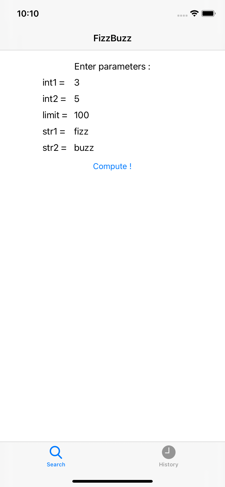
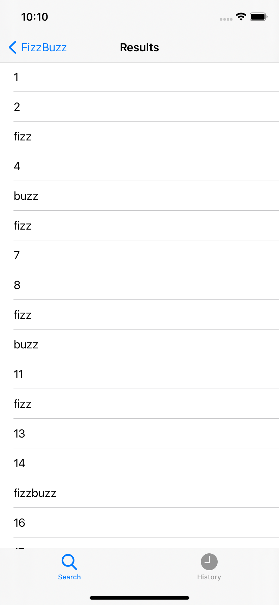
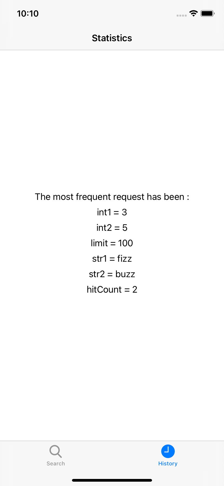

# Requirements:

Write a simple fizz-buzz application.
 
The original fizz-buzz consists in writing all numbers from 1 to 100, and just replacing all multiples of 3 by "fizz", all multiples of 5 by "buzz", and all multiples of 15 by "fizzbuzz". The output would look like this: "1,2,fizz,4,buzz,fizz,7,8,fizz,buzz,11,fizz,13,14,fizzbuzz,16,...".
 
Your goal is to implement an application that :
- Have a form that accepts five parameters : three integers int1, int2 and limit, and two strings str1 and str2.
- Display a list of strings with numbers from 1 to limit, where: all multiples of int1 are replaced by str1, all multiples of int2 are replaced by str2, all multiples of int1 and int2 are replaced by str1str2.
- Display a statistics view allowing users to know what the most frequent request has been. This view should display a graphical representation of the parameters corresponding to the most complited form, as well as the number of hits for this form.
 
The application needs to be:
Ready for production
Easy to maintain by other developers
 
# Technical choices:

- classic UIKit 
- MVC for simple view controller
- MVVM for more complex view controller
- view controller in code: better control over UIKit and better for code review
- each view controller is independant of the other view controller
- Coordinator pattern to manage navigation between view controller
- some unit test
- a service to collect the statistics

 Of course I can adapt to project style if project style is Storyboard and Segue, I can do that also .
 
Other possibilites I can do is UIKit + RxSwift or even better, SwiftUI + Combine 😍

# Screenshots

